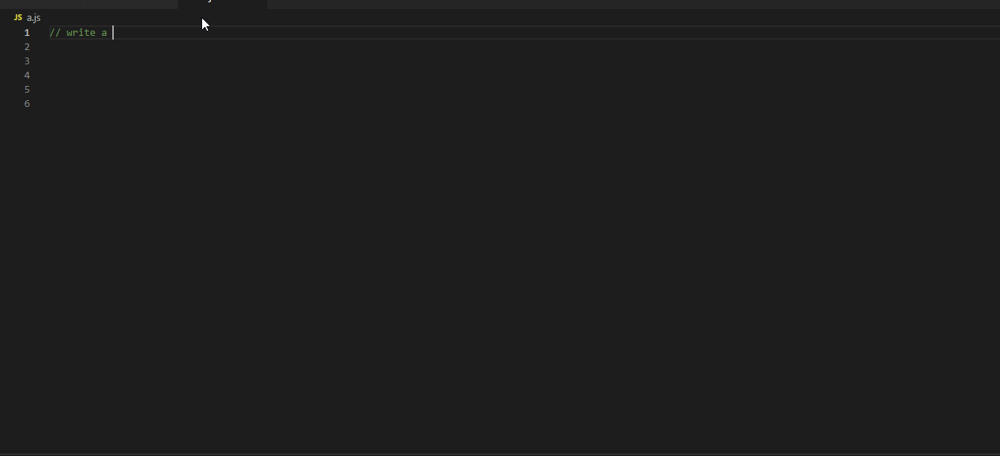

CodeGPT is an AI-based coding assistant, which can suggest code in the current or following lines.  It is powered by a large-scale model called [ReplitLM](https://github.com/replit/ReplitLM).

### Usage

Install the extension and enable it globally. The simple usage is provided below:

Keep CodeGPT activated, it will start generating codes when you stop writing (the icon at the bottom of VSCode starts spinning). When the generated code is shown in gray, just press ``Tab`` to insert the generated codes.

CodeGPT will start generating codes when you stop writing (the icon at the bottom of VSCode starts spinning). When the generated code is shown in gray, just press ``Tab`` to insert the generated codes.

> Note:
>
> The generation always starts at the current position of your cursor, thus if you modify the code before the generation is finished, it will probably cause bugs. We keep working on making the generation faster.

### Example

### Privacy

We highly respect the privacy of your code. The code is only used as the input of CodeGPT to assist your programming.

### Thanks

Plugin development references [CodeGeeX](https://github.com/THUDM/CodeGeeX)
