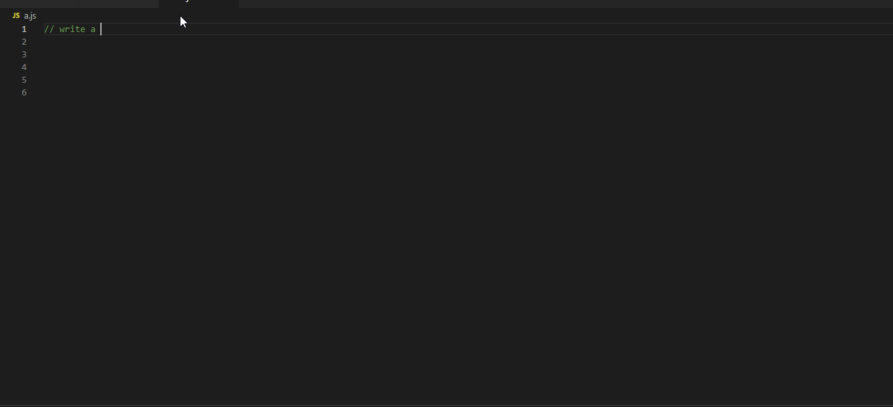

CodeGPT 是基于 [ReplitLM](https://github.com/replit/ReplitLM) 开发的插件，可以实现通过描述生成代码、补全代码功能。Happy Coding!

### 使用指南

安装插件并全局激活 CodeGPT，使用如下：

保持 CodeGPT 处于激活状态，当您停止输入时，会从当前光标处开始生成（右下角 CodeGPT 图标转圈表示正在生成）。 生成完毕之后会以灰色显示，按 `Tab` 即可插入生成结果。

CodeGPT 将在您停止输入时，从光标处开始生成（右下角 CodeGPT 图标转圈表示正在生成）。生成完毕之后会以灰色显示，按 Tab 即可插入生成结果。

> 注意：
>
> 生成总是从当前光标位置开始，如果您在生成结束前移动光标位置，可能会导致一些 bugs。我们正在努力使生成速度变得更快以提升用户体验。

### 示例

### 隐私声明

我们高度尊重用户代码的隐私，代码仅用来辅助编程。

### 致谢

插件开发参考 [CodeGeeX](https://github.com/THUDM/CodeGeeX)
